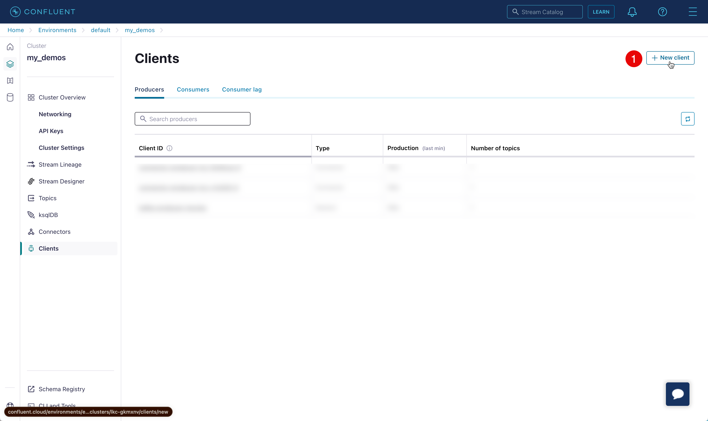

# Kafka with Confluent Schema Registry

A demo to show how to produce and consume messages from [Confluent](https://cloud.confluent.io)' managed [Apache Kafka](https://kafka.apache.org). The messages are validated using [Apache Avro](https://avro.apache.org) schema.

This project uses Quarkus, the Supersonic Subatomic Java Framework. If you want to learn more about Quarkus, please visit its website: <https://quarkus.io/> .

## Pre-requisites

- [Confluent](https://cloud.confluent.io) Account
- [Confluent CLI](https://docs.confluent.io/confluent-cli/current/install.html)

### Confluent Cloud Kafka Settings

We will extract the Confluent Cloud Cluster settings for Java client. From the Confluent Cloud dashboard click **Add Client** to start generating the new client wizard,



1. On the next page of the wizard choose **Java**,


2. Generate new Confluent Cloud API Key by clicking the button **Create Kafka cluster API key**,


On the wizard give an optional description to the Key such as "Kafka API Key", download and save the key. For further reference lets call the downloaded file as `api-keys.txt`

From the downloaded file `api-keys.txt` set the following environment variables:

```shell
export KAFKA_BOOTSTRAP_SERVERS=<value of Bootstrap server from the api-keys.txt file>
export CLUSTER_API_KEY=<value of API key form the api-keys.txt file>
export CLUSTER_API_SECRET=<value of API secret form the api-keys.txt file>
```

3. Generate new Confluent Schema Registry API Key by clicking the button **Create Schema Registry API Key**,


On the wizard give an optional description to the Key such as "Schema Registry API Key", download and save the key. For further reference lets call the downloaded file as `sr-api-keys.txt`

From the downloaded `sr-api-keys.txt` file set the following environment variables:

```shell
export SR_API_KEY=<value of API key form the sr-api-keys.txt.txt file>
export SR_API_SECRET=<value of API secret form the sr-api-keys.txt.txt file>
```

Finally you can copy the entire configuration properties and save it to a file `config.properties`.


```shell
export KAFKA_SCHEMA_REGISTRY_URL=<value of schema.registry.url from the file config.properties>
```

> **Tip**:
>
> You can add all exports defined earlier to a file called `.env` and source it on your shell or us [direnv](https://direnv.net)
> an example `.env` looks like
>
> ```shell
> export KAFKA_BOOTSTRAP_SERVERS=<value of Bootstrap server from the api-keys.txt file>
> export CLUSTER_API_KEY=<value of API key form the api-keys.txt file>
> export CLUSTER_API_SECRET=<value of API secret form the api-keys.txt file>
> export SR_API_KEY=<value of API key form the sr-api-keys.txt.txt file>
> export SR_API_SECRET=<value of API secret form the sr-api-keys.txt.txt file>
> export KAFKA_SCHEMA_REGISTRY_URL=<value of schema.registry.url from the file config.properties>
> ```

## Running the application in dev mode

You can run your application in dev mode that enables live coding using:

```shell script
./mvnw compile quarkus:dev
```

> **_NOTE:_** Quarkus now ships with a Dev UI, which is available in dev mode only at <http://localhost:8080/q/dev/>.

### Produce and Consume Messages

To produce and consume streaming messages from CLI, we will use [httpie](https://httpie.io). Download and install httpie for your platform.

Open a new terminal and run the following command that will display the streamed messages,

```shell
http -v --stream http://localhost:8080/movies
```

Open another new terminal and run the following command to add some movies to the topic,

```shell
http -v http://localhost:8080/movies/add title="The Dark Knight" year=2008
http -v http://localhost:8080/movies/add title="The Shawshank Redemption" year=1994
http -v http://localhost:8080/movies/add title="The Godfather" year=1954
http -v http://localhost:8080/movies/add title="12 Angry Men" year=1957
```

As you add the messages, you should see the deserialized JSON on the other terminal as shown below,

```shell
data:{
    "title": "The Shawshank Redemption",
    "year": 1994
}

data:{
    "title": "The Shawshank Redemption",
    "year": 1994
}
```

The deserialized JSON conforms to the Avro schema defined in `src/main/avro/movie.avsc`.

## Packaging and running the application

The application can be packaged using:

```shell script
./mvnw package
```

It produces the `quarkus-run.jar` file in the `target/quarkus-app/` directory.
Be aware that it’s not an _über-jar_ as the dependencies are copied into the `target/quarkus-app/lib/` directory.

The application is now runnable using `java -jar target/quarkus-app/quarkus-run.jar`.

If you want to build an _über-jar_, execute the following command:

```shell script
./mvnw package -Dquarkus.package.type=uber-jar
```

The application, packaged as an _über-jar_, is now runnable using `java -jar target/*-runner.jar`.

## Creating a native executable

You can create a native executable using:

```shell script
./mvnw package -Dnative
```

Or, if you don't have GraalVM installed, you can run the native executable build in a container using:

```shell script
./mvnw package -Dnative -Dquarkus.native.container-build=true
```

You can then execute your native executable with: `./target/kafka-avro-demo-1.0.0-SNAPSHOT-runner`

If you want to learn more about building native executables, please consult <https://quarkus.io/guides/maven-tooling>.

## Related Guides

- Confluent Schema Registry - Avro ([guide](https://quarkus.io/guides/kafka-schema-registry-avro)): Use Confluent as Avro schema registry
- SmallRye Reactive Messaging - Kafka Connector ([guide](https://quarkus.io/guides/kafka-reactive-getting-started)): Connect to Kafka with Reactive Messaging
- [Kafka 101](https://www.youtube.com/watch?v=j4bqyAMMb7o&list=PLa7VYi0yPIH0KbnJQcMv5N9iW8HkZHztH)
